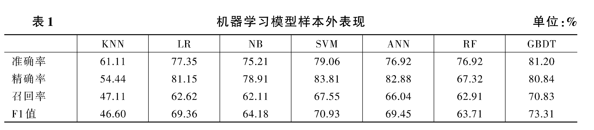
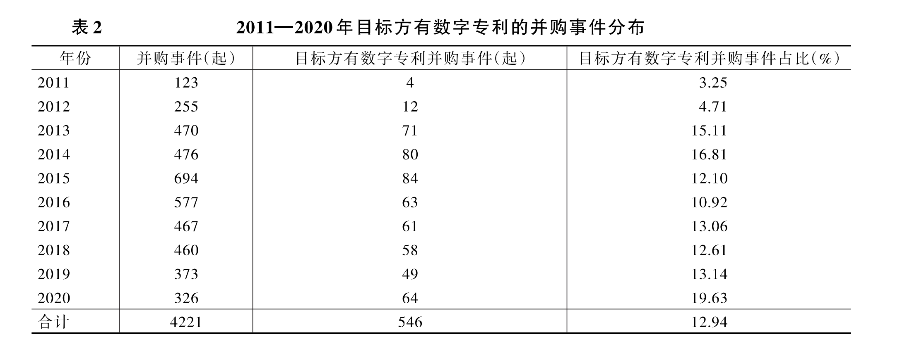
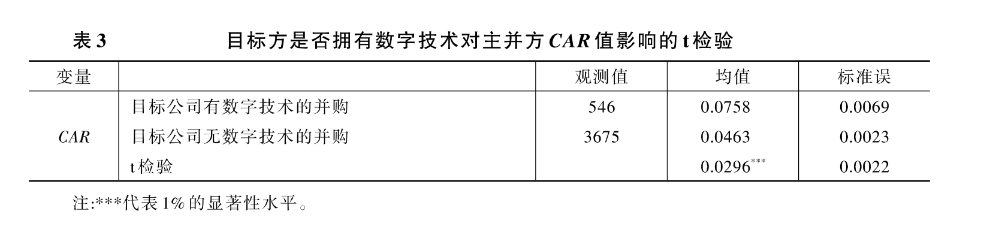
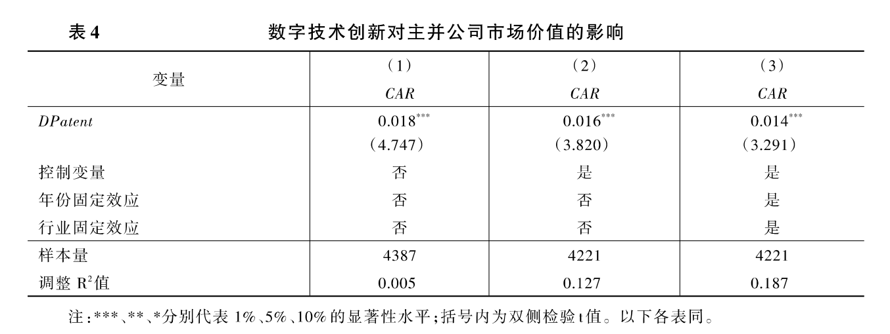
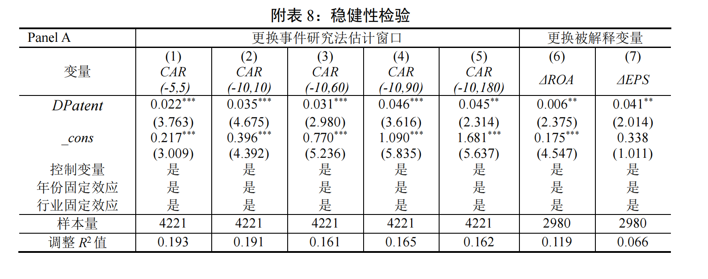
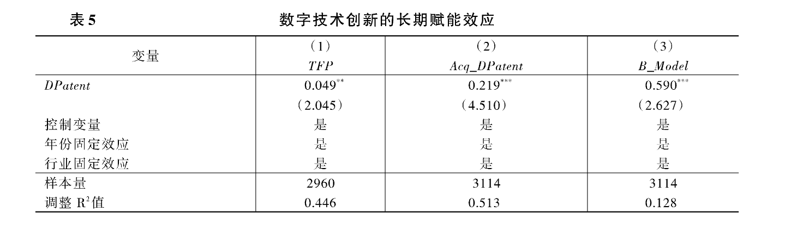
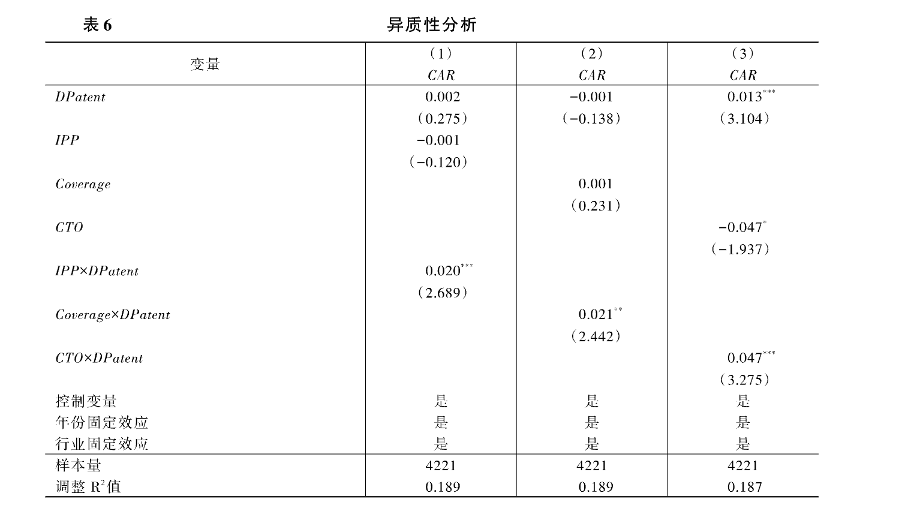
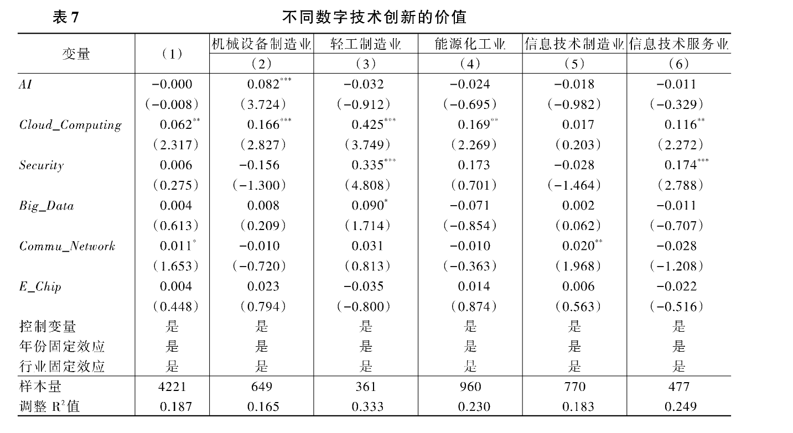

数字技术创新的价值 --基于并购视角和机器学习方法的分析<br>
作者：周鹏，王卓，谭常春，宋敏<br>
关键词：数字技术创新；并购；机器学习
# <h1 align = "center">一、研究背景、边际贡献以及理论假说</h>
## <center>1.1 研究背景</center>
&emsp;&emsp;创新是保持企业核心竞争优势的关键，也是推动国家经济增长的第一动力,数字技术创新作为数字经济的核心驱动力，是新一轮“角逐”的关键。国家发布的《“十四五”数字经济发展规划》中进一步明确要把创新作为引领数字经济发展的第一动力。尽管数字技术创新发展势头迅猛并获得广泛关注，但对于数字技术创新能否为企业带来价值的研究还存在不足，**尤其是在新兴市场国家鲜有学者从微观视角实证探究数字技术创新对企业价值的影响**。本文将从**并购视角**实证探究数字技术创新能否提升企业价值。
## <center>1.2 边际贡献</center>
&emsp;&emsp;①创新性地从并购视角探究数字技术创新的价值，不仅拓展了数字技术的相关研究，也为衡量创新的价值提供了新思路。<br>
&emsp;&emsp;②运用**文本分析**和**Word2Vec算法**构建适用且全面的数字专利词库，对数字专利进行更精准地识别。<br>
&emsp;&emsp;③利用机器学习模型，对数字技术创新进行更精确地分类，探究了不同类别技术对企业以及对不同行业的价值，为各行业进行数字化变革提供了启示。
## <center>1.3 研究假说</center>
&emsp;&emsp;数字技术具有渗透性、替代性和协同性的特征,能在生产效率、技术创新和商业模式方面为企业带来价值。数字技术通过自动化和数字增强、数字化扩展以及数字转型，可以增强、拓展、替代传统商业模式。从封闭转向开放的商业模式，能够使得企业灵活应对环境变化，抓住外部机会，提高自身绩效。<br>
&emsp;&emsp;**假说：在其他条件不变的情况下，目标公司的数字专利越多，企业并购所产生的累积超额收益率越大，即为并购公司带来的价值越大。**
# <h1 align = "center">二、数字技术创新定义与分类</h>
&emsp;&emsp;1.数字技术创新界定：数字专利是衡量数字技术发展水平的重要指标，精准识别数字技术相关专利，对科学评估数字技术创新的作用具有重要意义。本文通过构建数字专利词库，用词库中的词汇作为关键词获取并购事件中目标企业的数字专利信息。<br>
&emsp;&emsp;2.数字技术词库构建:首先，从学术文献、政策文件以及搜狗词库中整理出数字技术相关的词汇并以此构建基础词库。然后，为了保证词库的专业性同时减少相关词汇的遗漏，利用**Word2Vec算法**从数字专利文本语料中挖掘与基础词库高度相关的技术词汇作为扩充词库。将基础词库和扩充词库合并去重后得到最终词库。<br>
&emsp;&emsp;3.数字技术专利获取：从国家知识产权局获取并购双方企业的所有专利。依据上述步骤构建的数字专利词库，如果**专利名称或摘要包含数字专利词库的词语，则该专利被标记为数字技术专利。**<br>
&emsp;&emsp;4.数字技术创新分类：本文运用有监督的机器学习对数字专利进行分类。在确定数字技术类型后，创建训练样本并训练分类算法。根据模型表现选出最优分类算法，最后对全部数字专利进行分类。<br>
&emsp;&emsp;(1)训练样本和机器学习模型构建：本文选取了多个在经管领域广泛使用的机器学习分类模型，包含：`K近邻(KNN)、逻辑回归 (LR)、朴素贝叶斯(NB)、支持向量机(SVM)、神经网络(ANN)、随机森林(RF)、梯度提升树(GBDT)。`调整好每个模型的超参数后，本文将测试集输入模型查看各个分类器的性能。<br>
&emsp;&emsp;(2)机器学习模型表现：使用四个常用的性能指标进行分析，即准确率、精确率、召回率、F1值，每个性能指标都是根据六个数字技术创新类型的平均性能得分计算的。<br>

&emsp;&emsp;本文用拟合好的GBDT模型对全部41832件数字专利进行分类，最终分类结果包含44.85%的通信网络技术、23.82%的人工智能技术、17.81%的电子芯片技术、9.93%的大数据技术、2.11%的安全技术和1.48%的云计算技术。其中，2011—2020年样本并购事件中目标企业的数字专利申请数量呈逐年上升趋势。通信网络技术和人工智能技术数量在所有数字专利中的占比超过50%,而云计算技术和安全技术占比较小。
# <h1 align = "center">三、研究设计</h>
## <center>3.1 数据来源</center>
&emsp;&emsp;本文选取2011—2020年中国沪深A股上市公司为买方的并购数据为初始样本。并购事件信息、上市公司的股票收益率以及财务数据均来自国泰安数据库($`CSMAR`$) 。并购双方的工商信息和专利数据分别来自全国企业信用查询系统和国家知识产权局($`SIPO`$)。对并购事件进行如下处理：<br>
&emsp;&emsp;①剔除并购失败的事件；<br>
&emsp;&emsp;②剔除要约收购、债务重组和并购比例小于5%的事件；<br>
&emsp;&emsp;③剔除标的方不属于企业的样本；<br>
&emsp;&emsp;④剔除金融行业和交易金额缺失样本；<br>
&emsp;&emsp;⑤剔除$`ST`$、$`PT`$公司样本；<br>
&emsp;&emsp;⑥为保证事件影响的独立性，对同一买方在30天内发生多次并购仅保留第一个事件。<br>
&emsp;&emsp;本文最终得到4221起并购事件。为了排除离群值的影响，本文还对所有连续变 量进行了双侧1%的缩尾处理。
## <center>3.2 变量定义</center>
&emsp;&emsp;本文主要涉及到3方面的变量：<br>
&emsp;&emsp;(1)累积超额收益率($`CAR`$)：本文使用累积超额收益率度量并购带来的市场价值，并通过并购事件为主并方带来的市场收益测度数字技术创新的价值。<br>
&emsp;&emsp;(2)数字技术创新($`DPatent`$)：目标企业并购公告发生前一年的数字专利申请数加1后取自然对数。<br>
&emsp;&emsp;(3)控制变量：本文在企业层面控制了企业市值($`MKT`$)、企业成立年龄($`Age`$)、资产负债率($`LEV`$)、现金流($`Cashflow`$)、增长能力($`Growth`$)、独立董事占比($`Indep`$)、研发投入($`R_D`$);在并购事件特征层面控制了是否关联交易($`Relevance`$)、是否重大资产重组($`MajorMA`$)、交易价格($`Dealvalue`$)。同时加入了主并方专利申请($`Acq_Patent`$)以控制。<br>
&emsp;&emsp;由主并方自身的创新带来的并购收益。此外，考虑到目标企业的其他非数字技术特征，如盈利能力、非数字技术创新等也可能带来并购收益，并且大量研究认为企业盈利能力与创新产出正相关，本文控制了目标企业非数字专利申请($`Tar_Patent`$)。
## <center>3.3 模型设定</center>
&emsp;&emsp;为捕捉数字技术创新的价值，本文设定了如下模型:<br>
$$CAR_i=\beta_0+\beta_1DPatent_{i,t}+\gamma^{\prime}Controls+Year_t+Industry_j+\varepsilon_i$$
&emsp;&emsp;其中，$`CAR_{i}`$表示主并企业在并购公告发布前后3个交易日的累积超额收益率$`CAR_{i}(-3,3)`$；$`DPatent_{i,t}`$表示目标企业数字技术创新；$`Controls`$为一系列企业层面和并购事件层面的控制变量，$`Year`$和$`Industry`$分别为年份和行业固定效应。本文重点关注$`DPatent_{i,t}`$的系数$`β₁`$,若$`β₁`$显著为正，说明数字技术创新能为企业带来价值。
## <center>3.4 描述性统计</center>
&emsp;&emsp;表2展示了样本区间内各年份并购事件的数量和其中目标方有数字专利的并购事件的数量。 2011—2020年，无论是并购事件总数还是目标方有数字专利的并购数量，均呈现总体上升趋势，且  都在2015年达到高峰：样本中并购事件共有694起，其中目标方有数字专利的并购事件多达84起， 占比12.1%,这与曾敏(2022)关于2014年中国并购支持政策引致并购浪潮的发现一致。虽然2015 年后并购事件数量回落，但目标方有数字专利的并购事件占比总体呈上升趋势，在2020年达到了 19.63%。数字技术并购浪潮的产生，也凸显了并购在企业获取数字技术和进行数字化转型中的重要作用。
<center class ='img'></center>

# <h1 align = "center">四、实证结果分析</h>
## <center>4.1 基准回归结果</center>
&emsp;&emsp;根据目标公司是否拥有数字专利，本文将并购事件分为两类，并比较这两类并购的市场表现。结果如表3所示，目标方在并购前一年内有数字专利申请，能给主并方在窗口期内带来平均7.58%的累积超额收益率；相比之下，上市公司并购没有数字专利的目标方在公告日前后3日内仅获得平均4.63%的累积超额收益率。$`t`$检验结果表明两组之间差异显著,前者的$`CAR`$显著高于后者2.96%,说明上市公司并购拥有数字技术的目标方能带来更高的短期市场涨幅。
<center class ='img'></center>

&emsp;&emsp;在基准回归中，本文采用逐步控制的回归策略。第(1)列为未加入任何控制变量的结果，数字技术创新$`DPalent`$回归系数为0.018且在1%的水平上显著为正；第(2)列回归中加入了控制变量，核心解释变量系数显著性水平未发生变化；第(3)列进一步控制了年份、行业固定效应。结果显示，$`DPatent`$回归系数为0.014,在1%的水平上显著为正，说明目标方拥有的数字专利数量越多，并购方股票市场反应越大，表明数字技术创新能为企业带来较大的市场价值。
```stata
use 数据1,clear

**** 表4
winsor2 MKT Lev Cashflow Growth Indep Age R_D Acq_Patent Dealval DPatent Tar_Patent CAR,replace cut(1 99)

global CTR MKT Age Lev Cashflow Growth Dealval Relevance MajorMA Indep Acq_Patent Tar_Patent R_D

eststo clear
qui eststo : reg CAR D_MA $CTR i.year i.ind2,r
ttest CAR if _est_est1==1, by(D_MA)
```
<center class ='img'></center>

## <center>4.2 稳健性检验</center>
&emsp;&emsp;(1)更换事件研究法的估计窗口，本文增加了$`CAR(-5,5)`$和$`CAR(-10,10)`$，同时，考虑到短期市场存在投资者过度反应，本文还分别将估计窗口替换为$`CAR(-10,60)`$、$`CAR(-10,90)`$以及$`CAR(-10,180)`$，重新回归后结论与基准回归结果一致。<br>
&emsp;&emsp;(2)更换被解释变量。一是考虑到基础结论更多说明的是数字技术创新的短期市场价值，`保留主并方每年首次并购完成的样本，将被解释变量分别替换为企业并购完成后第二年相较于并购发起前一年$`ROA`$的变化$`△ROA`$和$`EPS`$的变化$`△EPS`$,以证实数字技术创新的价值不仅存在于短期`；二是考虑到当前结果可能是由于投资者热点追捧或概念炒作行为所导致的，利用行业收益率调整后的超额收益重新计算$`CAR`$,回归结果依然稳健。<br>
```stata
**** 附表8 第1-5列

eststo clear
eststo: reg CAR5 DPatent $CTR i.year i.ind2,r 
eststo: reg CAR10 DPatent $CTR i.year i.ind2,r  
eststo: reg CAR60 DPatent $CTR i.year i.ind2,r 
eststo: reg CAR90 DPatent $CTR i.year i.ind2,r 
eststo: reg CAR180 DPatent $CTR i.year i.ind2,r 

esttab,r2 indicate("Year=*year*" "Industry=*ind*")  star(* 0.1 ** 0.05 *** 0.01) nogap compress
esttab est* using "Results.docx", rtf append star(* 0.1 ** 0.05 *** 0.01) b(%6.3f) t(%6.3f)  nogap compress ar2(%6.3f) indicate( " Year= *year*" "Industry=*ind*") title("ATable 8 1-5")

**** 附表8 第6-7列
gen deltaROA = fwROA-lagROA
gen deltaEPS = fweps-lageps

eststo clear
eststo: reg deltaROA DPatent $CTR i.year i.ind2 if rank==1,r 
eststo: reg deltaEPS DPatent $CTR i.year i.ind2 if rank==1,r

esttab,r2 indicate("Year=*year*" "Industry=*ind*")  star(* 0.1 ** 0.05 *** 0.01) nogap compress
esttab est* using "Results.docx", rtf append star(* 0.1 ** 0.05 *** 0.01) b(%6.3f) t(%6.3f)  nogap compress ar2(%6.3f) indicate( " Year= *year*" "Industry=*ind*") title("ATable 8 6-7")

```
<center class ='img'></center>

&emsp;&emsp;(3)替换核心解释变量。首先用目标公司在并购前一年内是否拥有数字专利申请的虚拟变量$`D_MA`$进行替换。然后，使用目标企业并购前一年内数字技术专利申请数占总专利申请数的比值$`DPatent_ratio`$进行替换。此外，改变对核心解释变量的定义，将目标企业并购公告发生前一年内的数字专利申请分别变为前2—5年内的数字专利申请进行重新测度，结论与基准回归结果一致。<br>
&emsp;&emsp;(4)更严格的控制方法。考虑到存在行业层面随时间变动的不可观测因素，本文进一步控制了年份×行业固定效应。此外，各省份间经济发展水平和数字基础设施建设水平存在的差异，会影响当地企业数字技术创新。本文也进一步加入了年份×省份固定效应，以控制地区随年份变化因素的影响。本文还同时控制了年份x行业、年份×省份固定效应，回归结果保持稳健。<br>
&emsp;&emsp;(5)倾向得分匹配法PSM***。为了减少内生性以及样本不平衡可能带来的估计偏误，本文将目标方有数字专利的并购与目标方没有数字专利的并购进行$`PSM`$样本配对回归。选取公司市值、公司年龄、资产负债率等企业特征以及是否为重大并购等并购事件特征作为$`PSM`$的匹配变量，依据目标方被并购前一年是否有数字技术专利的虚拟变量$`D_MA`$, 分别采用全样本1:1近邻匹配和逐年1:1邻近匹配方法，然后用匹配后的样本重新估计基础模型，结论与基准结果保持一致。<br>
&emsp;&emsp;(6)$`Heckman`$两阶段模型。第一阶段，构建$`Probit`$模型估计逆米尔斯比率$`IMR`$，以检验滞后期的上市公司特征变量能否影响其开展有数字技术创新的并购$`D_MA`$; 第二阶段，将$`IMR`$作为控制变量加入基准回归方程(1),以纠正潜在的选择性偏差对本文研究结论的干扰，结论保持不变。<br>
```stata
**** 附表8 第8-9列
eststo clear
qui eststo : reg CAR D_MA $CTR i.year i.ind2,r
qui eststo : reg CAR DPAT_rate $CTR i.year i.ind2,r
esttab , ar2 indicate(" Year= *year*" "Industry=*ind*" )  star(* 0.1 ** 0.05 *** 0.01) nogap compress
esttab est* using "Results.docx", rtf append star(* 0.1 ** 0.05 *** 0.01) b(%6.3f) t(%6.3f)  nogap compress ar2(%6.3f) indicate( " Year= *year*" "Industry=*ind*") title("ATable 8 8-9")


**** 附表8 第10-12列
encode prov,gen(area)

eststo clear
qui eststo : reg CAR DPatent $CTR i.year i.ind2 i.year#i.ind2 ,r
qui eststo : reg CAR DPatent $CTR i.year i.ind2 i.year#i.area ,r
qui eststo : reg CAR DPatent $CTR i.year i.ind2 i.year#i.ind2 i.year#i.area ,r

esttab,r2 indicate("Year=*year*" "Industry=*ind*" )  star(* 0.1 ** 0.05 *** 0.01) nogap compress
esttab est* using "Results.docx", rtf append star(* 0.1 ** 0.05 *** 0.01) b(%6.3f) t(%6.3f)  nogap compress ar2(%6.3f) indicate( " Year= *year*" "Industry=*ind*") title("ATable 8 10-12")

**** 附表8 第13列
use 数据1.dta,clear

eststo clear

qui eststo : reg CAR DPatent $CTR i.year i.ind2,r
keep if _est_est1==1

set seed 1
gen tmp=runiform()
sort tmp

psmatch2 D_MA $CTR, out(CAR) logit ate neighbor(1) common caliper(.05) ties
pstest $CTR , both 
logout, save("ptest.docx") word replace:pstest $CTR , both title("ptest")


winsor2 MKT Age Lev Cashflow Growth Dealval Relevance Indep Acq_Patent R_D *CAR* DPatent* Tar_Patent*,replace cut(1 99)

global CTR MKT Age Lev Cashflow Growth Dealval Relevance MajorMA Indep Acq_Patent Tar_Patent R_D


*REG
eststo clear
qui eststo : reg CAR DPatent $CTR i.year i.ind2 if _weight!=. ,r

esttab , ar2 indicate(" Year= *year*" "Industry=*ind*")  star(* 0.1 ** 0.05 *** 0.01) nogap compress
esttab est* using "Results.docx", rtf append star(* 0.1 ** 0.05 *** 0.01) b(%6.3f) t(%6.3f)  nogap compress ar2(%6.3f) indicate( " Year= *year*" "Industry=*ind*") title("ATable 8 13")


**** 附表8 第14列
use 数据1.dta,clear

winsor2 MKT Age Lev Cashflow Growth Dealval Relevance Indep Acq_Patent R_D *CAR* DPatent* Tar_Patent*,replace cut(1 99)

global CTR MKT Age Lev Cashflow Growth Dealval Relevance MajorMA Indep Acq_Patent Tar_Patent R_D

forvalues i = 2011/2020{

 use 数据1.dta,clear

 keep if year==`i'
 set seed 1
 gen tmp=runiform()
 sort tmp

 psmatch2 D_MA $CTR, out(CAR) logit ate neighbor(1) common caliper(.05) ties
 save psmdid_`i',replace
}

use psmdid_2011,clear

forvalues i = 2012/2020{

 append using psmdid_`i'
 erase psmdid_`i'.dta
}

pstest $CTR, both
logout, save("ptest_yr.docx") word replace:pstest $CTR , both title("ptest by year")

drop if _weight==.

*REG
eststo clear
qui eststo : reg CAR DPatent $CTR i.year i.ind2 if _weight!=. ,r
esttab , ar2 indicate(" Year= *year*" "Industry=*ind*")  star(* 0.1 ** 0.05 *** 0.01) nogap compress
esttab est* using "Results.docx", rtf append star(* 0.1 ** 0.05 *** 0.01) b(%6.3f) t(%6.3f)  nogap compress ar2(%6.3f) indicate( " Year= *year*" "Industry=*ind*") title("ATable 8 14")

*GRAPH
twoway (kdensity _ps if _treat==1,lp(solid) lw(*2.5))(kdensity _ps ///
if _wei!=.,lp(dash) lw(*2.5)), ytitle("Density", size(*1.1)) ///
ylabel(,angle(0) labsize(*1.1)) ///
xtitle("Propensity Score", size(*1.1)) ///
xscale(titlegap(2)) ///
xlabel(0(0.2)0.8, format(%2.1f) labsize(*1.1)) ///
legend(label(1 "D_MA") label(2 "Non D_MA") row(2)position(3) ring(0) ///
size(*1.1)) scheme(s1mono)
graph save "Fig Density",replace  ///


**** 附表8 第15列
use 数据1.dta,clear

winsor2 MKT Age Lev Cashflow Growth Dealval Relevance Indep Acq_Patent R_D *CAR* DPatent* Tar_Patent* *ROA* *eps* DPAT_rate DPatentN,replace cut(1 99)

global CTR MKT Age Lev Cashflow Growth Dealval Relevance MajorMA Indep Acq_Patent Tar_Patent R_D

* 计算IMR
global Lag LagMKT LagAge LagLev LagCashflow LagGrowth LagAcq_Patent LagIndep LagR_D

qui probit D_MA $Lag i.year i.ind2,r
predict w,xb
gen IMR=normalden(w)/normal(w)

* 加入IMR 
eststo clear
eststo: reg CAR DPatent IMR $CTR i.year i.ind2,r  
esttab,r2 indicate("Year=*year*" "Industry=*ind*")  star(* 0.1 ** 0.05 *** 0.01) nogap compress
esttab est* using "Results.docx", rtf append star(* 0.1 ** 0.05 *** 0.01) b(%6.3f) t(%6.3f)  nogap compress ar2(%6.3f) indicate( " Year= *year*" "Industry=*ind*") title("ATable 8 15")

```
<center class ='img'></center>

&emsp;&emsp;(7)更严格地识别数字专利。考虑到数字技术词汇出现在专利名称或摘要中可能具有一定的偶然性，本文首先对数字技术专利进行重新定义，然后将重新识别的目标企业数字专利进行加1取对数处理后估计模型。其次，根据所获取的企业工商数据和产品标签，将拥有数字专利的企业经营范围和产品限定在数字经济产业范围内，然后重新回归，结论保持不变。
```stata
**** 附表8 第16列
use 数据1.dta,clear

winsor2 MKT Age Lev Cashflow Growth Dealval Relevance Indep Acq_Patent R_D *CAR* DPatent* Tar_Patent*,replace cut(1 99)

global CTR MKT Age Lev Cashflow Growth Dealval Relevance MajorMA Indep Acq_Patent Tar_Patent_ipc R_D

eststo clear

qui eststo : reg CAR DPatent_ipc $CTR i.year i.ind2,r
esttab,r2 indicate("Year=*year*" "Industry=*ind*")  star(* 0.1 ** 0.05 *** 0.01) nogap compress
esttab est* using "Results.docx", rtf append star(* 0.1 ** 0.05 *** 0.01) b(%6.3f) t(%6.3f)  nogap compress ar2(%6.3f) indicate( " Year= *year*" "Industry=*ind*") title("ATable 8 16")


**** 附表8 第17列
global CTR MKT Age Lev Cashflow Growth Dealval Relevance MajorMA Indep Acq_Patent Tar_Patent_limit R_D

eststo clear

qui eststo : reg CAR DPatent_limit $CTR i.year i.ind2,r
esttab,r2 indicate("Year=*year*" "Industry=*ind*")  star(* 0.1 ** 0.05 *** 0.01) nogap compress
esttab est* using "Results.docx", rtf append star(* 0.1 ** 0.05 *** 0.01) b(%6.3f) t(%6.3f)  nogap compress ar2(%6.3f) indicate( " Year= *year*" "Industry=*ind*") title("ATable 8 17")


**** 附表8 第18-21列
eststo clear
forvalues i=2/5{
	global CTR MKT Age Lev Cashflow Growth Dealval Relevance MajorMA Indep Acq_Patent Tar_Patent`i' R_D
	qui eststo : reg CAR DPatent`i' $CTR i.year i.ind2,r
}

esttab,r2 indicate("Year=*year*" "Industry=*ind*")  star(* 0.1 ** 0.05 *** 0.01) nogap compress
esttab est* using "Results.docx", rtf append star(* 0.1 ** 0.05 *** 0.01) b(%6.3f) t(%6.3f)  nogap compress ar2(%6.3f) indicate( " Year= *year*" "Industry=*ind*") title("ATable 8 18-21")


**** 附表8 第22列
use 数据1.dta,clear

winsor2 MKT Age Lev Cashflow Growth Dealval Relevance Indep Acq_Patent R_D *CAR* DPatent* Tar_Patent*,replace cut(1 99)

global CTR MKT Age Lev Cashflow Growth Dealval Relevance MajorMA Indep Acq_Patent Tar_Patent R_D

eststo clear

qui eststo : reg indCAR3 DPatent $CTR i.year i.ind2,r
esttab,r2 indicate("Year=*year*" "Industry=*ind*")  star(* 0.1 ** 0.05 *** 0.01) nogap compress
esttab est* using "Results.docx", rtf append star(* 0.1 ** 0.05 *** 0.01) b(%6.3f) t(%6.3f)  nogap compress ar2(%6.3f) indicate( " Year= *year*" "Industry=*ind*") title("ATable 8 22")

```
<center class ='img'></center>

## <center>4.3 数字技术创新的长期赋能效应</center>
&emsp;&emsp;本文进一步探究数字技术创新在带来短期市场价值的同时能否为企业带来经济效益。理论分析认为，主并方能通过快速利用和学习等方式推动目标企业数字技术为自身发挥作用，赋能企业的生产、技术创新和商业模式变革。为此，本文分别从并购方的全要素生产率、数字技术产出以及商业模式创新三个方面进行考察。参考已有研究，构建如下模型：<br>
$$Y_{i}=\beta_{0}+\beta_{1}DPatent_{i}+\delta^{\prime}Controls+Year_{i}+Industry_{j}+\varepsilon_{i}$$
&emsp;&emsp;其中，$`Y_{i}`$表示主并方并购i完成后第二年全要素生产率($`TFP`$)、数字技术产出($`Acq_DPatent`$)以及商业模式创新($`B_Model`$);采用并购完成后第二年的变量主要是考虑到企业通过并购获取的 数字技术发挥作用存在一定的时滞。此外，需要说明的是，当企业从并购首次公告到并购完成存在较长时间跨度时，可能存在其他混杂因素影响回归结果，因此，本文删除了时间跨度大于两年的并购事件样本。对于同一企业在同一年内多次并购完成事件，本文保留企业在当年完成的第一起并购样本。被解释变量的计算和定义分别如下：<br>
&emsp;&emsp;(1)生产效率。本文利用全要素生产率($`TFP`$)进行度量，构建如下模型测算基于$`OP`$法下的$`TFP`$:

$$\begin{aligned}\ln Y_{i,t}&=\beta_0+\beta_k\ln K_{i,t}+\beta_i\ln L_{i,t}+\beta_m\ln M_{i,t}+\beta_aAge_{i,t}+\beta_sState_{i,t}+\beta_eEX_{i,t}\\&+\sum_m\delta_myear_m+\sum_n\lambda_nprov_n+\sum_k\xi_kind_k+\varepsilon_{i,t}\end{aligned}$$

&emsp;&emsp;其中，$`Y_{i,t}`$表示营业收入；$`ln K_{i,t}`$为资本投入，用固定资产价值来衡量；$`ln L_{i,t}`$为劳动投入，用企业员工人数自然对数测度；$`ln M_{i,t}`$是中间投入，即销售额减增加值，其中，增加值为折旧、劳动者报酬、生产税净额和营业盈余四项之和；$`Age_{i,t}`$是企业年龄；$`State_{i,t}`$为是否民营企业虚拟变量；$`EX_{i,t}`$表示企业 是否出口虚拟变量，$`year_m`$、$`prov_n`$,和$`ind_k`$,分别是年份、地区和行业固定效应；$`\varepsilon_{i,t}`$为随机误差项。状态变量为$`ln K_{i,t}`$和$`Age_{i,t}`$; 控制变量为$`State_{i,t}`$和$`EX_{i,t}`$；代理变量为企业投资$`ln I_{i,t}`$；退出变量$`exit`$根据企业的生存经营情况生成。所有的名义变量都转换为以2000年为基期的实际值。<br>
&emsp;&emsp;(2)数字技术创新。本文认为相较于并购方的全部创新，通过数字专利测度主并公司的数字技术创新更能直观体现通过并购获取的数字技术的作用。主并公司的数字技术判断和获取方式与前文相同。本文剔除目标公司在并购后与主并企业合作创新的专利样本，再对主并方当年申请专利进行加总，最后加1取自然对数得到主并公司的数字技术创新($`Acq_DPatent`$)。<br>
&emsp;&emsp;(3)商业模式创新。用上市公司每年年报中“管理层讨论与分析”($`MD&A`$)部分的业务创新和流程创新词频测度商业模式。用业务创新和流程创新词频之和除以$`MD&A`$文本总字数后乘以10000,最后得到商业模式创新变量($`B_Model`$)。<br>
```stata
**** 表5
eststo clear
qui eststo : reg CAR DPatent,r
qui eststo : reg CAR DPatent $CTR ,r
qui eststo : reg CAR DPatent $CTR i.year i.ind2,r

esttab,r2 indicate("Year=*year*" "Industry=*ind*" )  star(* 0.1 ** 0.05 *** 0.01) nogap compress
esttab est* using "Results.docx", rtf append star(* 0.1 ** 0.05 *** 0.01) b(%6.3f) t(%6.3f)  nogap compress ar2(%6.3f) indicate( " Year= *year*" "Industry=*ind*") title("Table 5")
```
<center class ='img'></center>

# <h1 align = "center">五、进一步分析</h>
## <center><mark>5.1 异质性分析</mark></center>
&emsp;&emsp;(1)地区知识产权保护力度。较强的地区知识产权保护能增加当地企业的创新投入和创新产出(吴超鹏和唐药，2016)。一方面，数字经济活动依托数据资源和现代信息技术，在增加知识和技术传播速度的同时加剧了侵权行为的模仿(赵宸宇，2021),知识产权保护降低了技术被窃取的风险，提高了创新的价值；另一方面，并购完成后，知识产权保护力度较强地区的企业更有动力研发新技术，发挥创新协同效应，从而带来更积极的市场绩效。本文借鉴龙小宁等(2018),采用国家知识产权局发布的历年《中国知识产权发展状况评价报告》中的知识产权保护指数(IPP) 作为地区知识产权保护力度的衡量指标。根据中位数将各省份知识产权保护力度划分为高和低两组，若低于中位数IPP为0,否则为1,在模型(1)中引入知识产权保护力度(IPP)与数字技术创新的交互项。结果如表6第(1)列所示，IPP×DPatent的系数在1%水平上显著为正，表明数字技术创新在知识产权保护力度大的地区能发挥更高价值。<br>
&emsp;&emsp;(2)分析师关注度。证券分析师作为资本市场信息中介，缓解了市场参与者之间的信息不对称，提高了资本市场的有效性。具备专业能力的分析师能有效评估企业创新这类专业化活动的价值，并向市场传递信息。为了检验分析师关注度对数字技术创新价值的作用，本文参考已有文献的普遍做法，用一年内对某企业进行跟踪的分析师数量测度分析师关注度(Coverage)。根据中位数将分析师跟踪数量划分为高低两组，若低于中位数Coverage为0，否则为1。表6第(2)列报告了结果，Coverage×DPatent与被解释变量存在显著正向关系，说明分析师关注度越高，数字技术创新为主并方带来的价值更大。因为数字技术涉及领域广、专业性强，分析师关注能提高企业创新信息透明度，帮助普通投资者理解企业数字技术的应用情况，增加数字技术创新为企业带来的价值。<br>
```stata
**** 表6
use 数据2.dta,clear

winsor2 MKT Age Lev Cashflow Growth Indep Acq_Patent Tar_Patent R_D B_Model Acq_DPatent *TFP* DPatent,replace cut(1 99)

global CTR MKT Age Lev Cashflow Growth Indep Acq_Patent Tar_Patent R_D 
global CTR2 MKT Age Lev Cashflow Growth Indep Tar_Patent R_D 

gen deltayear = year-syear
drop if deltayear>2 //删除并购跨度大于两年

keep if rank==1 //保留每年第一个并购事件

****
eststo clear

qui eststo: reg TFP_OP DPatent $CTR i.year i.ind2, r

qui eststo: reg Acq_DPatent DPatent $CTR2 i.year i.ind2, r

qui eststo: reg B_Model DPatent $CTR i.year i.ind2, r

esttab,r2 indicate("Year=*year*" "Industry=*ind*" )  star(* 0.1 ** 0.05 *** 0.01) nogap compress
esttab est* using "Results.docx", rtf append star(* 0.1 ** 0.05 *** 0.01) b(%6.3f) t(%6.3f)  nogap compress ar2(%6.3f) indicate( " Year= *year*" "Industry=*ind*") title("Table 6")
```
<center class ='img'></center>

&emsp;&emsp;(3)企业首席技术官。高管能通过监督和咨询对并购发挥重要作用，尤其当技术并购活动需要
高管的建议和知识时，会伴随产生较高的并购绩效(Schmidt,2015)。首席技术官(Chief Technology Officer,CTO)作为企业高管团队的重要成员，负责企业技术研发与创新战略选择，以确保技术创新为企业增加价值。企业在进行数字化变革时需要技术型高管的引导，以跨越“数字鸿沟”,打通“信息孤岛”,提升数字技术价值。从上市公司年报中收集CTO的设立情况，若企业在并购前设立首席技术官，CTO为1，反之为0。同理，本文在基础模型中分别引入CTO与DPatent交乘项进行回归。结果如表6第(3)列所示，交乘项系数在1%水平上显著为正，说明CTO能为企业数字化发展制定合理战略决策、提供专业建议，让数字技术创新迸发更大价值。
## <center>5.2 不同数字技术创新类型的价值</center>
&emsp;&emsp;为进一步分析哪些类型的数字技术创新对企业最有价值以及各类技术对不同行业发挥作用的程度，本文根据前文机器学习对数字技术创新的分类结果，参考Chen et al.(2019)构建多元回归模型进行分析。具体模型如下：<br>
$$CAR_i=\alpha+\beta'Technologies_{i,t}+\gamma'Controls+Year_i+Industry_j+\varepsilon_i$$
&emsp;&emsp;其中 ，$`Technologies`$包含了人工智能技术($`Al`$)、云计算技术($`Cloud_Computing`$)、安全技术 ($`Security`$)、大数据技术($`Big_Data`$)、通信网络技术($`Commu_Network`$)和电子芯片技术($`E_Chip`$),计算方式为目标公司拥有的该类技术数量加1取自然对数；其他变量与模型(1)一致。本文关注的是$`β`$，即各类技术的回归系数。<br>
&emsp;&emsp;结果如表7第(1)列所示，$`Cloud_Compuling`$和$`Commu_Nelwork`$的系数分别为0.062和0.011,且分别在5%和10%水平上显著为正，而其他技术的系数并未出现统计意义上的显著性。这说明相较于人工智能、大数据、安全技术和电子芯片四类技术，云计算技术和通信网络技术的价值更大。这可能是因为大多数企业当前还处于数据获取和存储的数字化初期阶段。通信网络技术中的传感技术，能帮助企业更高效、精确地获取数据；云计算能以低成本解决企业数据存储问题，帮助企业优化数据资产管理，为实现进一步的数据共享、数据挖掘利用以及其他数字技术的拓展应用提供可能。<br>
```stata
**** 表7
eststo clear

qui eststo : reg CAR C.DPatent##c.HIPP $CTR i.year i.ind2,r
qui eststo : reg CAR C.DPatent##c.HF $CTR i.year i.ind2,r
qui eststo : reg CAR c.DPatent##c.CTO $CTR i.year i.ind2,r

esttab , ar2 indicate(" Year= *year*" "Industry=*ind*")  star(* 0.1 ** 0.05 *** 0.01) nogap compress
esttab est* using "Results.docx", rtf append star(* 0.1 ** 0.05 *** 0.01) b(%6.3f) t(%6.3f)  nogap compress ar2(%6.3f) indicate( " Year= *year*" "Industry=*ind*") title("Table 7")
```
<center class ='img'></center>

&emsp;&emsp;考虑到不同技术的赋能可能存在行业异质性，本文根据《数字经济及其核心产业统计分类 (2021)》以及各行业所处数字化阶段的特征，进一步聚焦并购企业细分行业，并重点关注处在产业 数字化阶段的机械设备制造业、轻工制造业和能源化工业，以及处在数字产业化阶段的信息技术制 造业和信息技术服务业。表7第(2)—(4)列结果表明，就处在产业数字化的行业而言，一是人工智能和云计算技术对于机械设备制造业企业价值较大。这可能是由于该行业企业正处于数字化转型初期，在整合自身数据(焦豪等，2021;戚聿东等，2021)并进行云端存储的同时，会利用人工智能技术如工业机器人等实现生产的自动化和智能化。二是云计算技术、安全技术和大数据技术能为轻工制造业带来较大价值，但数字化转型初期所需的云计算和安全技术价值更大。以纺织服饰行业为例，需求个性化的特点决定了其需要获取海量客户数据进行大数据分析，并基于云计算技术和安全技术进行数据管理和保障数据安全。三是云计算技术能为能源化工业企业带来较大的价值。<br>
&emsp;&emsp;对于处在数字产业化的行业，云计算、通信网络以及安全技术的价值较为明显，因为企业主要以自身业务为主线，并运用新兴技术赋能其业务的数字化。第(5)列中$`Commu_Network`$系数在5%水平上显著为正，说明包含电子信息、通信业等信息技术制造业主要通过传感、5G等通信网络技术创造价值；第(6)列中$`Cloud_Computing`$和$`Security`$系数分别在5%和1%水平上显著为正，表明包含了以软件、互联网技术服务为主营业务的信息技术服务业企业，其业务除了依赖大规模和高效率的存储条件，还需要安全技术为经营过程中的数据传输、存储、共享和销毁提供保障。云计算技术与安全技术的结合能为信息技术服务业带来安全性、可靠性以及效率的提升。

# <h1 align = "center">六、结论与启示</h>
&emsp;&emsp;本文利用中国沪深A股上市公司2011—2020年的并购数据，在获取并购双方企业专利数据的基础上通过Word2Vec算法构建了适用于数字专利的词库，利用机器学习分类模型对数字技术创新进行了更细致的分类，实证探究了数字技术创新能否以及如何为企业带来价值。结论表明，目标企业的数字技术创新越多，并购公司的市场价值提升就越大，表现为并购产生的累积超额收益率的显著增加；目标公司拥有的数字技术具有长期赋能效应，即显著提升了并购企业的生产效率、数字技术创新以及商业模式创新；较强的知识产权保护、更高的分析师关注度以及拥有首席技术官，能分别作为并购公司的外部和内部因素，使数字技术的价值提升作用更明显；云计算技术和通信网络技术对主并公司更具价值提升作用。人工智能技术和云计算对机械设备制造行业的赋能作用最明显，安全、云计算和大数据技术能共同为轻工制造业带来更大价值，这表明大部分企业可能还处于数字化初级阶段。基于以上结论，本文提出如下政策启示：<br>
&emsp;&emsp;(1)加强数字技术研发与创新，推动数字经济核心产业发展。数字技术创新是数字经济发展的核心动力，是推动数字产业化的坚实基础，也是社会数字化转型的重要支撑。一方面，不仅要加大数字技术企业的研发投入力度、提高基础研发能力，而且要关注数字经济所需的新技术应用场景，为数字经济发展提供前沿技术、产品、服务和解决方案；另一方面，加强数字经济核心产业企业通过如并购、产业链间资源共享等多种方式获取数字知识，推动创新协同和技术融合。在掌握数字经济发展自主权的同时，立足中国资本市场和企业数字能力，提高数字技术创新的价值，打造在新一轮科技革命和产业变革机遇下的竞争新优势。<br>
&emsp;&emsp;(2)推进各行业数字技术融合，加速产业数字化转型升级。数字技术能助力企业降本提质增效，提升各部门要素的协同应用，改善资源配置效率，进而推动产业数字化升级。企业要强化自身数字化思维。传统行业的企业可以通过并购等外部资源获取方式，更高效地提高企业管理效率、技术创新和数字应用能力。需加速实现在数字化初期阶段的数据资源化，推进数据要素价值化，为进一步数智化升级打下坚实基础。同时，要立足各产业不同特点和需求，差异化使用数字技术，制定和实施相应产业数字化战略，推动传统产业全方位数字化转型。<br>
&emsp;&emsp;(3)打造支持数字化的服务环境，综合提升数字技术创新价值。良好的外部环境和内部资源能提高企业数字化转型的意愿和数字技术应用的能力。应以制度和服务双重协同，通过技术、人才、资本等内外部要素，综合解决企业转型风险大、难度高等问题。例如，加强地区知识产权保护、提高 企业数字技术创新在资本市场的信息透明度、加大企业对数字技术人才的引进力度和提高数字化转型过程中的专业技术咨询等，多方位提升数字技术在企业数字化变革中的价值。<br>
&emsp;&emsp;需要说明的是，由于本文利用并购这一外生方式测度数字技术创新的价值，而导致样本数量较少，实证结论及其可拓展性有待利用大样本进一步检验。同时，考虑到数字技术创新产生的长期市场超额收益(BHAR)，受各种混淆因素影响较大、难以准确捕捉，本文尚未对其进行实证检验。因此，如何利用大样本更合理地测度数字技术创新的价值仍值得深入研究。
